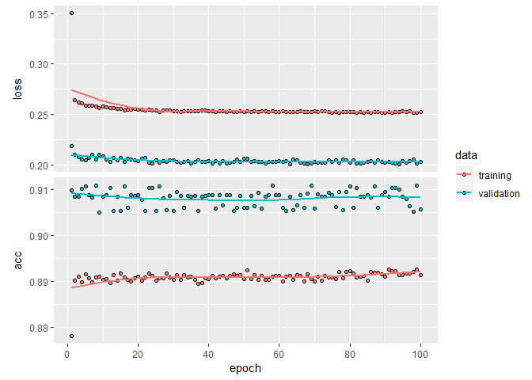

Neural Net- Branch
================

``` r
library(keras)
library(tidyquant)
library(rsample)
library(recipes)
library(corrr)
library(tidyverse)
library(yardstick)
```

Read the data into R, change predictor to factor

``` r
#read data into R, mutate target variable as factor
data_18122018v3_anon<-read_csv("C:/Users/Michael/Desktop/data_18122018v3_anon.csv")
data<-data_18122018v3_anon%>%dplyr::mutate(target_var=as.factor(target_var))%>%select(target_var,var8,var9)
```

``` r
#look at data
glimpse(data)
```

    ## Observations: 37,955
    ## Variables: 3
    ## $ target_var <fct> 0, 0, 0, 0, 0, 0, 0, 0, 0, 1, 0, 0, 0, 0, 0, 0, 0, ...
    ## $ var8       <int> 0, 0, 0, 0, 0, 0, 0, 0, 0, 1, 0, 2, 0, 3, 0, 2, 0, ...
    ## $ var9       <int> 0, 0, 0, 0, 0, 0, 0, 0, 0, 4, 0, 3, 0, 3, 0, 4, 0, ...

``` r
#check for NA
colSums(is.na(data))
```

    ## target_var       var8       var9 
    ##          0          0          0

Split data into training and test sets

``` r
# Split test/training sets
set.seed(100)
train_test_split <- initial_split(data, prop = 0.8)
train_test_split
```

    ## <30365/7590/37955>

``` r
# Retrieve train and test sets
train_tbl <- training(train_test_split)
test_tbl  <- testing(train_test_split)
```

Use the recipe package to create a workflow for scaling testing data based on training data

``` r
# Create recipe to scale data
rec_obj <- recipe(target_var ~., data = train_tbl) %>%
  step_center(all_predictors()) %>%
  step_scale(all_predictors()) %>%
  prep(data = train_tbl)
```

Apply the recipe to the rec\_obj to two new predictor variables

``` r
x_train_tbl <- bake(rec_obj, newdata = train_tbl) %>% dplyr::select(-target_var)
x_test_tbl  <- bake(rec_obj, newdata = test_tbl) %>% dplyr::select(-target_var)
```

Have a look at one of the new tables I've created

``` r
glimpse(x_train_tbl)
```

    ## Observations: 30,365
    ## Variables: 2
    ## $ var8 <dbl> -0.55149065, -0.55149065, -0.55149065, -0.55149065, -0.55...
    ## $ var9 <dbl> -0.6105669, -0.6105669, -0.6105669, -0.6105669, -0.610566...

Extract the response variable for training and testing sets and place into a vector

``` r
y_train_vec <- ifelse(pull(train_tbl, target_var) == "1", 1, 0)
y_test_vec  <- ifelse(pull(test_tbl, target_var) == "1", 1, 0)
```

The data is now in a suitable format for the neural network

Now, to build the model

``` r
# Building the model
model_keras <- keras_model_sequential()

model_keras %>% 
  
  # First hidden layer
  layer_dense(
    units              = 17, 
    kernel_initializer = "uniform", 
    activation         = "relu", 
    input_shape        = ncol(x_train_tbl)) %>% 
  
  # Dropout to prevent overfitting
  layer_dropout(rate = 0.1) %>%
  
  # Second hidden layer
  layer_dense(
    units              = 17, 
    kernel_initializer = "uniform", 
    activation         = "relu") %>% 
  
  # Dropout to prevent overfitting
  layer_dropout(rate = 0.1) %>%
  
  # Output layer
  layer_dense(
    units              = 1, 
    kernel_initializer = "uniform", 
    activation         = "sigmoid") %>% 
  
  # Compile ANN
  compile(
    optimizer = 'adam',
    loss      = 'binary_crossentropy',
    metrics   = c('accuracy')
  )
```

This is what the model parameters look like

``` r
model_keras
```

    ## Model
    ## ___________________________________________________________________________
    ## Layer (type)                     Output Shape                  Param #     
    ## ===========================================================================
    ## dense_1 (Dense)                  (None, 17)                    51          
    ## ___________________________________________________________________________
    ## dropout_1 (Dropout)              (None, 17)                    0           
    ## ___________________________________________________________________________
    ## dense_2 (Dense)                  (None, 17)                    306         
    ## ___________________________________________________________________________
    ## dropout_2 (Dropout)              (None, 17)                    0           
    ## ___________________________________________________________________________
    ## dense_3 (Dense)                  (None, 1)                     18          
    ## ===========================================================================
    ## Total params: 375
    ## Trainable params: 375
    ## Non-trainable params: 0
    ## ___________________________________________________________________________

Now, I fit the model, for 100 epochs, with a validation split of 20% of the training dataset. In reality, the model accuracy metrics stop increasing around 30 epochs.

``` r
#Fit model to training data

history <- fit(
  object           = model_keras, 
  x                = as.matrix(x_train_tbl), 
  y                = y_train_vec,
  batch_size       = 50, 
  epochs           = 100,
  validation_split = 0.20
)
```

The training and validation metrics show that even though there is a dropout function in the model,overfitting may have occurred

``` r
print(history)
```

    ## Trained on 24,292 samples, validated on 6,073 samples (batch_size=50, epochs=100)
    ## Final epoch (plot to see history):
    ## val_loss: 0.2032
    ##  val_acc: 0.9056
    ##     loss: 0.2527
    ##      acc: 0.8913

``` r
plot(history)
```



The metrics show that this model is extremely accurate on the training set.

``` r
# Predicted Class
pred <- predict_classes(object = model_keras, x = as.matrix(x_test_tbl)) %>%
  as.vector()

# Predicted Class Probability
prob<- predict_proba(object = model_keras, x = as.matrix(x_test_tbl)) %>%
  as.vector()


# Format test data and predictions for yardstick metrics
est<- tibble(
  truth      = as.factor(y_test_vec) %>% fct_recode(yes = "1", no = "0"),
  estimate   = as.factor(pred) %>% fct_recode(yes = "1", no = "0"),
  class_prob = prob
)

est
```

    ## # A tibble: 7,590 x 3
    ##    truth estimate class_prob
    ##    <fct> <fct>         <dbl>
    ##  1 no    no          0.00242
    ##  2 no    no          0.00242
    ##  3 no    no          0.00242
    ##  4 no    no          0.137  
    ##  5 no    no          0.00242
    ##  6 no    no          0.469  
    ##  7 yes   no          0.488  
    ##  8 no    no          0.468  
    ##  9 no    no          0.00242
    ## 10 no    no          0.238  
    ## # ... with 7,580 more rows

``` r
options(yardstick.event_first = FALSE)


# Confusion Table
est %>% conf_mat(truth, estimate)
```

    ##           Truth
    ## Prediction   no  yes
    ##        no  5946  648
    ##        yes  175  821

``` r
# Accuracy
est %>% metrics(truth, estimate)
```

    ## # A tibble: 1 x 1
    ##   accuracy
    ##      <dbl>
    ## 1    0.892

``` r
# AUC
est %>% roc_auc(truth, class_prob)
```

    ## [1] 0.9338665

``` r
# Precision
est %>% precision(truth, estimate)
```

    ## [1] 0.8242972

``` r
#Recall
est%>% recall(truth, estimate)
```

    ## [1] 0.5588836

``` r
# F1-Statistic
est%>% f_meas(truth, estimate, beta = 1)
```

    ## [1] 0.6661258

Conclusion
==========

The keras model is very accurate (and I prefer the R version rather than the Python version) and it is good confirmation that the variable selection for the logistic regression model is appropriate.
